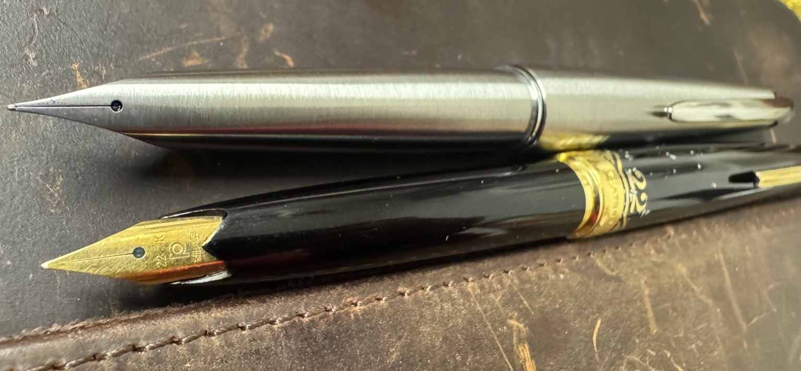

*图注｜两端*  
上：一体尖的不锈钢收敛——工程理性走到尽头的形态答案。  
下：22K 金尖的口袋钢笔——材料与时代情绪被允许走到的极限。  

---

### 一、第一批收藏

2019年八月四号，在ebay上看便宜钢笔的习惯刚刚开始没多久，意外的开始了ebay中古钢笔的拍卖之旅。 
第一次就首战告捷也是后来沉迷其中的一大因素吧。 主要看中的是Parker75，
而白金22K因为运费已经被涵盖，是一个极好的添头。 这是我的第一只和第二只金尖钢笔，
是的，当时眼里只有parker75，对22K的唯一想法是这么便宜买到22K金，亏不了。

到手之后， Parker75 是满意的，这只22K一直是一个被忽略的好孩子，
金尖软弹，笔画变化，下水流畅稳定，一支好钢笔应该具有的全部素质，22K都有。
短笔身、完整书写姿态、便携与稳定之间的平衡—— 
它不是缩小化的妥协，而是一种明确服务于**日常携带书写**的工程选择。

为什么我用22K总是写不了很多字就要换到别的笔，我自己很难说得清楚。 

---

### 二、使用之后：软弹的确认，与偏好的分离

在后来的长期使用中，我逐渐确认了我自己；  
在我不施压（来自英雄261笔不沾纸的习惯）的书写方式下，软弹对我无用。  

---

### 三、补完认知：口袋钢笔与 K 金大战

在之后几年对日本钢笔史的系统了解中，我才逐渐意识到：  
这支白金 22K 所处的，并非孤立型号，而是 **1960–70 年代日本“K 金大战”**中的关键节点。

在那场竞争中：
- 含金量从 14K 被不断推高  
- 口袋钢笔成为高 K 金笔尖的重要载体  
- **22K 被普遍视为“工程尚可控制的极限”**

再往上的 23K，更接近姿态展示而非书写理性。

> 延伸阅读：  
> - 日本口袋钢笔与 **K 金大战** 的历史背景  
>   https://pocketpenchronicle.com/專題：「k金尖戰爭與短鋼」

正是在这一背景下，白金 22K 成为一个**历史高度明确、但不需要重复拥有的节点**。

---

### 四、例外的存在：Myu 系列的另一条路径

在口袋钢笔这一门类中，真正构成例外的，是 **Pilot Myu 系列**。

Myu 并不参与传统意义上的 K 金竞赛：
- 不追求高含金量  
- 不强调软弹  
- 而是通过**一体尖（Integrated Nib）**这一结构性创新，走向另一条路径  

Myu 的价值在于：
- 工程逻辑的自洽  
- 设计与制造的高度统一  
- 以及它在日本钢笔史中所处的、不可重复的位置  

> 延伸阅读：  
> - Pilot **Myu 系列**的一体尖工程与历史位置  
>   https://www.fountainpennetwork.com/forum/topic/261386-pilot-myu/

Myu 的存在，使我对口袋钢笔的理解形成了清晰分叉：
- 一端是**材料与时代情绪**
- 另一端是**结构与工程理性**

---

### 五、长时间的空白：认可，但不再扩展

正因为上述认知逐渐清晰，在很长一段时间内：

- 我依然认可口袋钢笔这一形态  
- 但并未继续扩展这一门类的收藏  

原因并不复杂：
- 品类整体的软弹取向，并不完全对应我的长期书写偏好  
- 在历史位置与价格维度上，也难以超越白金 22K 所占据的节点  

**理解完成之后，投入自然停止。**

---

### 六、六年之后的另一端：M90

直到最近，在一个极好的价格与机缘下，我购入了第二支口袋钢笔——  
**Pilot M90**。

这并不是对口袋钢笔门类的“补齐”，而是一次**终点式的确认**。

M90 对我而言的意义在于：
- 它是 Myu 系列的延续与回望  
- 是一体尖这一工程路线的终章  
- 也是我口袋钢笔收藏中的**另一端**

---

### 七、两端之间，没有中间态

回看这六年多的路径，我的口袋钢笔收藏自然形成了一个极为清晰的结构：

- 一端：白金 22K  
  - K 金大战的高点  
  - 材料与时代情绪的集中体现  

- 另一端：Pilot M90  
  - 一体尖工程路线的终章  
  - 结构理性走到尽头的形态答案  

中间的大多数口袋钢笔，并非没有价值，  
但已经不再需要通过“拥有”来完成理解。

---

### 结语

这不是一个数量型的收藏门类，  
而是一个被**历史两端**清晰限定的区间。

对白金 22K 的早期相遇，是一次幸运；  
对 M90 的迟来选择，是一次确认。

它们之间隔着六年时间，  
却正好构成了我对口袋钢笔这一形态的完整理解。

——**两端，已经足够。**

