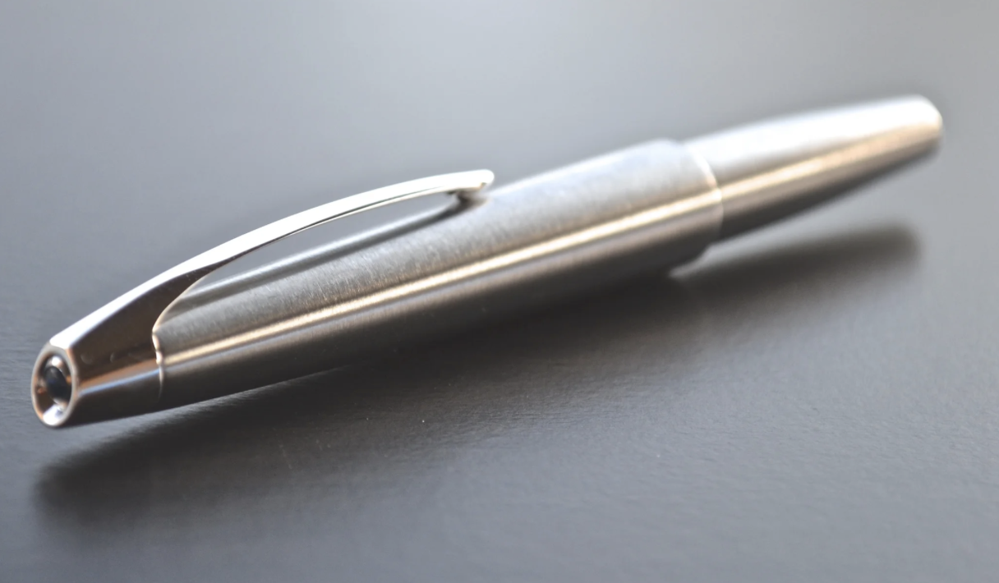
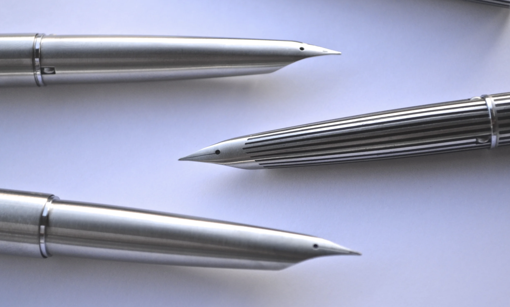
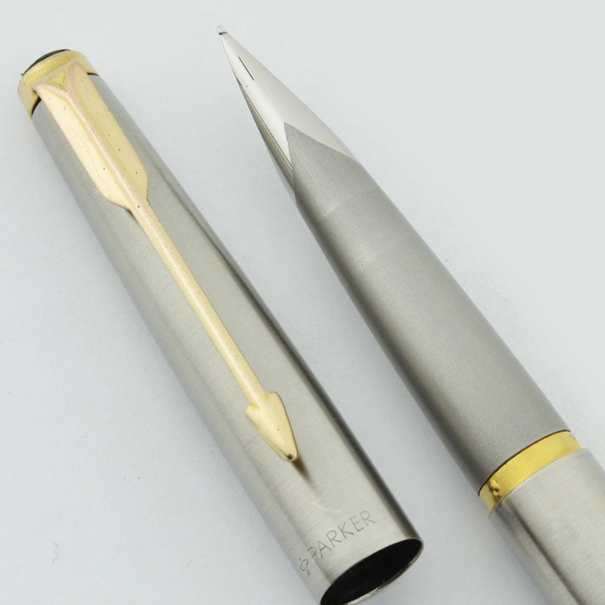

## 一体尖（Integrated / Unitary Nib）——终章  
### Pilot M90 与 Parker 50 Flighter

---

## 章节定位说明

本章节用于总结并封存本人钢笔收藏中关于**一体尖（Integrated / Unitary Nib）设计路线**的完整探索。  
在本章节完成后，该设计路线视为**收藏上已完成、不再扩展的方向**。

---

## 一、为何将“一体尖”单独成章

一体尖并非简单的造型变化，而是将**笔尖从可更换零件，提升为笔身结构本体**的设计决策，其核心特征包括：

- 笔身、握位与笔尖形成不可分割的连续形体  
- 制造难度前移，失败几乎不可逆  
- 对工艺一致性与材料控制提出极高要求  

因此，一体尖只可能存在于**设计与工程高度自信的年代**，而不适合长期、保守的商业环境。

---

## 二、Pilot 路线：从 MYU 701 到 M90 的纪念性完成

### 1. MYU 701（历史背景锚点）

1970 年代，Pilot 以 MYU 701 将一体钢尖、全金属、口袋笔形制推至原创高点。  
这一设计并非复古，而是当时对“未来书写工具”的真实想象。

### 2. Pilot M90：高成本前提下的工艺复刻与细节升级

Pilot M90 为 Pilot 创立 90 周年纪念限量款，其目标并非创新，而是在现代制造条件下，**重新完成 MYU 701 所代表的设计理想**。

其收藏意义体现在：

- 一体钢尖仍不可更换，但整体一致性与完成度明显优于 1970 年代作品  
- 拉丝不锈钢表面处理更加克制、均匀  
- 帽顶蓝色宝石作为非功能性纪念符号，强化其“封存型”身份  
- 上墨系统兼容 CON-20（年代正确）与 CON-40（日用可靠），具备“可逆使用”特性  

**历史定位总结：**

> Pilot M90 是在确认“一体尖不再回归主流”之后，  
> 对 MYU 701 设计神话的一次高成本、低妥协的最终封存。

---

## 三、Parker 路线：从 T1 的激进失败到 Parker 50 的理性妥协

### 1. Parker T1（必要前史）

Parker T1 以钛合金一体尖进行激进尝试，但受限于加工难度、成本失控及维修不可逆性，  
最终成为一次工程理想高于商业现实的失败案例。

### 2. Parker 50 Flighter：保留理念，收回风险

Parker 50（Falcon / Flighter）是在 T1 之后的复盘式产品：

- 材料由钛合金改为钢材  
- 保留一体尖与流线造型语言  
- 制造、成本与可靠性全面回归可控区间  

其核心价值不在激进，而在于**将激进设计驯化为可长期存在的产品**。

### 3. 成对收藏的意义：钢笔 + 圆珠笔

本人所藏 **Parker 50 Flighter 钢笔 + 圆珠笔成对组合**，  
体现了 Parker 一贯强调的“完整书写工具体系”理念，  
使该设计从单一尝试升级为完整商业方案。

---

## 四、审美与立场对照

| 维度 | Pilot M90 | Parker 50 Flighter |
|---|---|---|
| 文化背景 | 日本精密工业 | 美国航天未来主义 |
| 设计态度 | 极简、克制、纪念性封存 | 外放、流线、理性妥协 |
| 成本逻辑 | 高成本完成历史 | 降本以换取可靠 |
| 使用语境 | 更接近“完成的经典” | 更接近“可长期使用的工具” |
| 收藏角色 | 设计史终章 | 商业理性终点 |

---

## 五、个人收藏结论（终章声明）

本人关于一体尖设计路线的收藏，以以下两件作品完成闭环：

- **Pilot M90** —— 一体尖设计的纪念性终点  
- **Parker 50 Flighter（钢笔 + 圆珠笔）** —— 一体尖设计的商业理性终点  

> **一个为历史负责，一个为现实负责；  
> 它们在同一条设计道路的尽头停下。**

自此，一体尖在本人钢笔收藏体系中视为**已完成章节**。

